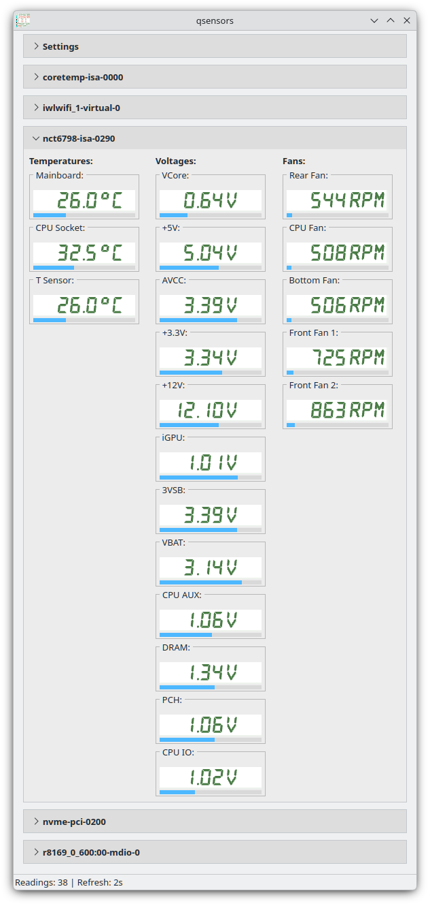

# qsensors

Qt6/Wayland-oriented sensor monitor with an xsensors-inspired UI and direct
`libsensors` access.



## Dependencies

- C++20 compiler
- CMake
- Qt6 (`Core`, `Gui`, `Widgets`)
- `libsensors` (lm-sensors)

## Build

```bash
cmake -S . -B build -DCMAKE_BUILD_TYPE=Release
cmake --build build -j
```

## Run

```bash
./build/qsensors
```

## Configuration

`QSettings` on Linux, typically:

`~/.config/qsensors/qsensors.conf`

Runtime keys currently used:
- `runtime/polling_interval_sec`
- `runtime/fan_default_max_rpm`
- `runtime/temperature_unit` (`C` or `F`, default `C`)

Temperature display is selectable in the settings panel (`Celsius` / `Fahrenheit`).

## Sensor range policy (normalization)

The backend returns normalized readings intended for direct rendering:
- native firmware limits are used when available
- missing limits are completed by qsensors category policy defaults
- for temperature readings, values and limits are returned in the requested
  display unit (`C` or `F`)

## License

This project is licensed under **GPL-2.0-or-later**.

- Full text: `LICENSE`
- Third-party notices: `THIRD_PARTY.md` and `third_party/xsensors/NOTICE.md`
